# World Layoffs - Data Cleaning

## About

This MySQL project focuses on cleaning and preparing a global dataset of layoffs reported in 2022. The goal is to ensure the data is ready for time-series analysis, exploratory data analysis (EDA), and insights generation regarding global economic shifts, industry impacts, and employment patterns.

The dataset was obtained from the [Kaggle World Layoffs Dataset](https://www.kaggle.com/datasets/swaptr/layoffs-2022), which includes information on companies, industries, countries, and the extent of layoffs over time.

## Purpose of the Project

The project aims to:

- Clean and standardize real-world data with inconsistencies.
- Handle missing values intelligently where applicable.
- Prepare the dataset for reliable data analysis.

## Dataset Overview

| Column                  | Description                                             | Data Type							|
|------------------------|---------------------------------------------------------|------------------------------------|
| company                | Name of the company where layoffs happened              | TEXT								|
| location               | Headquarters or main location of the company            | TEXT								|
| industry               | Sector in which the company operates                    | TEXT								|
| total_laid_off         | Number of employees laid off                            | INT 								|
| percentage_laid_off    | Percentage of total workforce laid off                  | TEXT								|
| date                   | Date of the layoff event                                | TEXT								|
| stage                  | Funding stage of the company                            | TEXT								|
| country                | Country in which the layoff occurred                    | TEXT								|
| funds_raised_millions  | Total funds raised by the company (in millions)         | INT								|

## Approach Used

### Step 1: Raw Data Import

- Dataset was imported directly into MySQL  from the layoffs.csv which is in data folder.
- MySQL auto-inferred data types based on raw data.

> Raw data preserved in a separate table `layoffs_raw` to ensure rollback is possible if needed.

### Step 2: Data Cleaning Steps

1. **Remove Duplicates**
   - Added a `row_num` column using window functions to identify duplicates.
   - Deleted duplicate entries based on `company`, `location`, and `date`.

2. **Standardize Data**
   - Trimmed extra spaces in `company` and `industry`.
   - Replaced inconsistent industry labels like “Crypto currency” → “Crypto”.
   - Standardized `country` names.

3. **Handle NULL and Blank Values**
   - Populated `NULL` and blank `industry` fields using data from the same `company`.
   - Set `industry = NULL` where values were blank strings.
   - Decided **not** to populate `total_laid_off` and `percentage_laid_off` as employee counts are unknown.

4. **Date Formatting**
   - Transformed date strings (in `m/d/y`) into MySQL `DATE` format (`yyyy-mm-dd`) for time-series analysis.

5. **Remove Unnecessary Columns**
   - Dropped `row_num` after cleaning.
   - Removed records where both `total_laid_off` and `percentage_laid_off` were missing.

## Cleaning Results (Before & After Snapshots)

Click to Expand

### Duplicates 
- **Before:**
  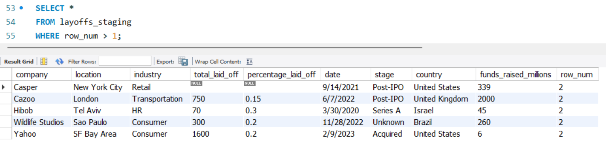
- **After:**
  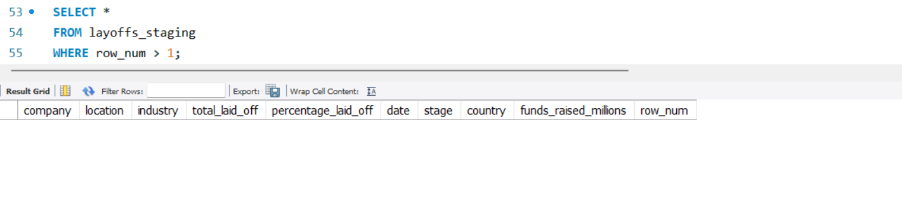

### Company Name Cleanup
| Before | After|
|-----------|-------|
|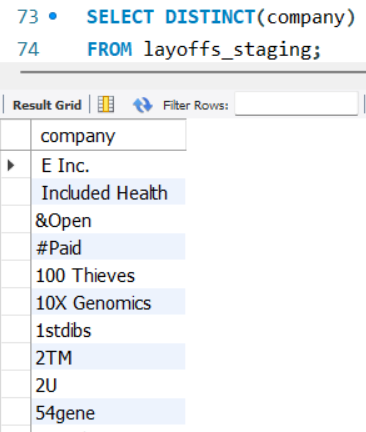|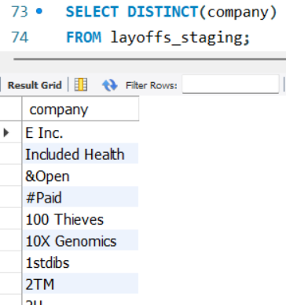|

### Industry Column
| Before | After|
|-----------|-------|
|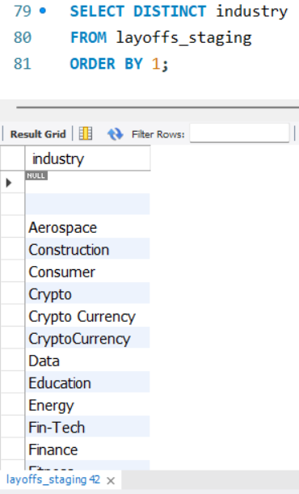|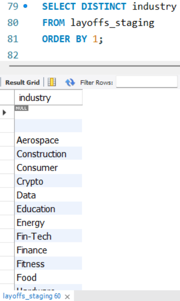|

### Country Names
| Before | After|
|-----------|-------|
|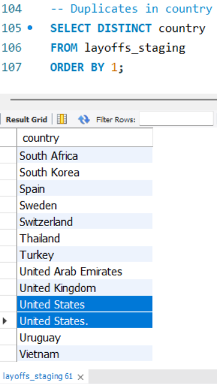|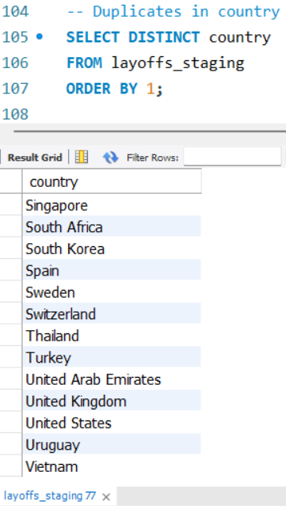|

### Date Formatting
| Before | After|
|-----------|-------|
|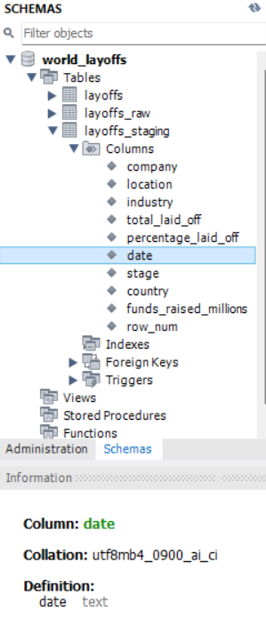|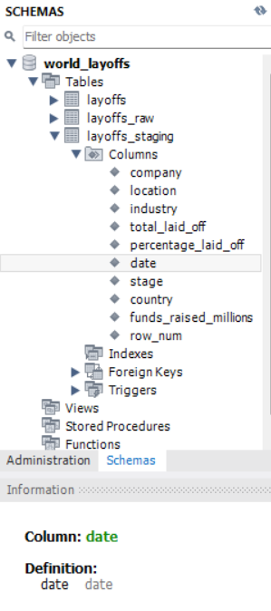|
|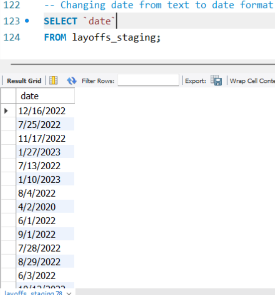|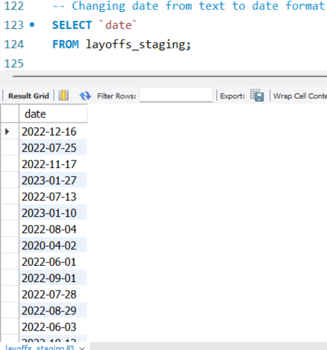|

### Populating Industry
- **Before:**
  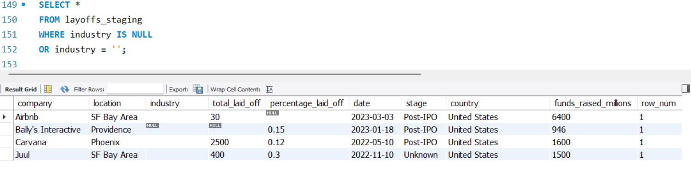
- **After:**
  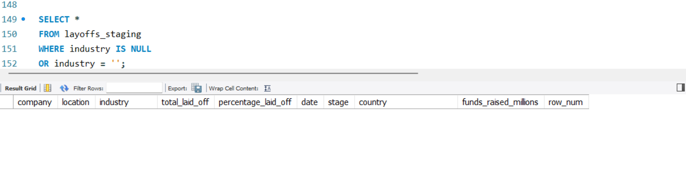

### Rows Removal having null in both total_laid_off and percentage_laid_off
- **Before:**
  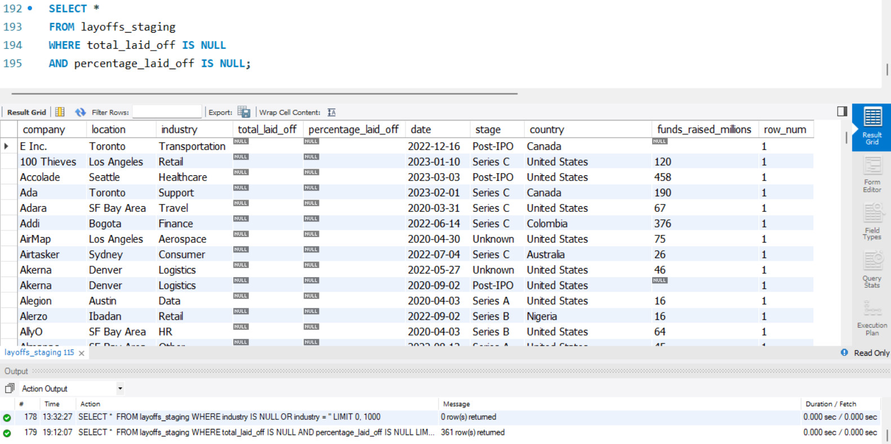
- **After:**
  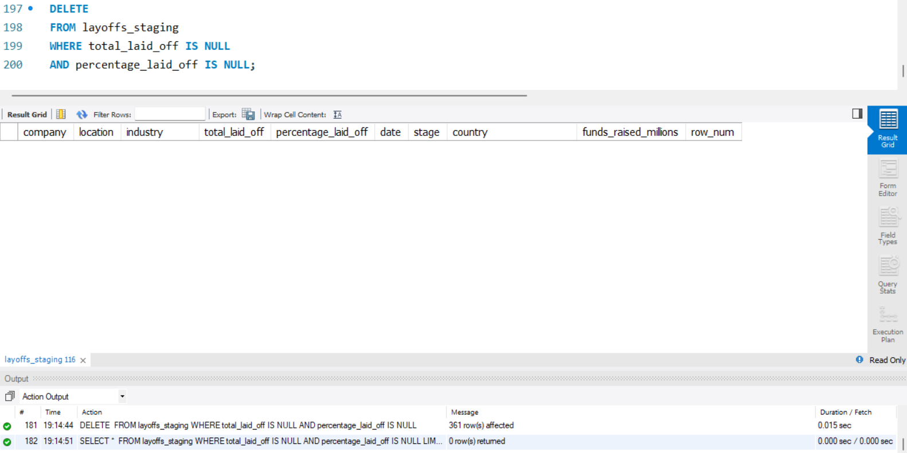

### Removal row_num
- **Before:**
  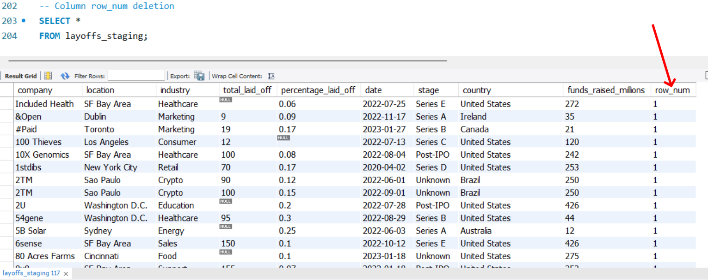
- **After:**
  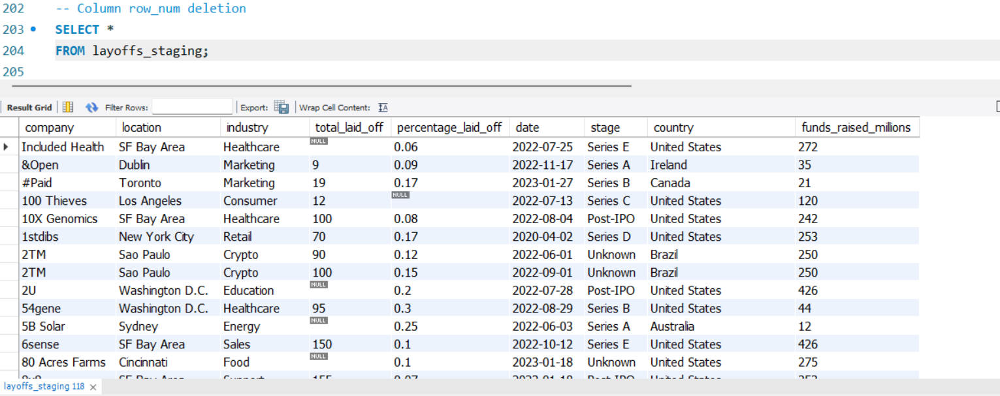

## Key Learnings

- Learned to use advanced SQL for cleaning, such as window functions and self-joins.
- Understood how to handle real-world data imperfections like inconsistent formats, null values, and dirty text.
- Established best practices for data cleaning such as maintaining a raw backup table.

## Tools Used

- **MySQL** – for data import, cleaning, and transformation
- **Kaggle** – for sourcing the dataset

## Future Work

- Exploratory data analysis (EDA) on layoffs trends [here](https://github.com/amanarya1r/World_Layoffs-EDA).

